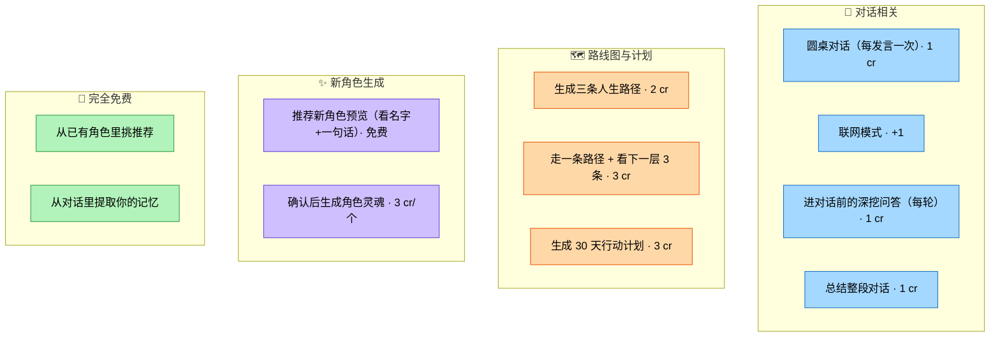
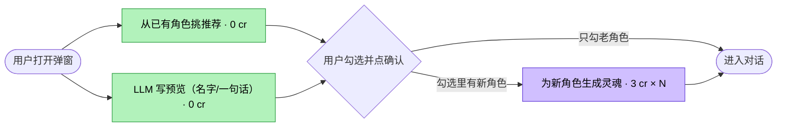
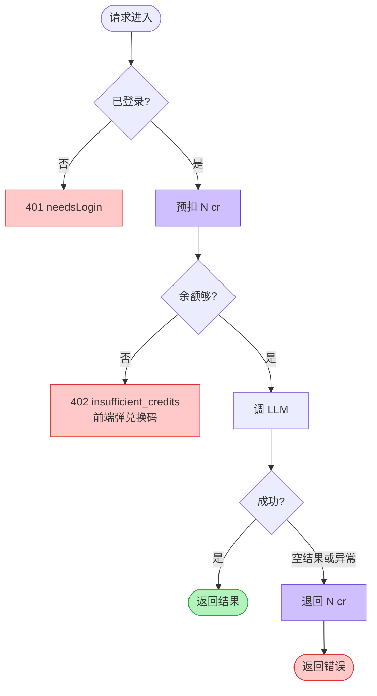

# LIFEE Credits 价目表（图）

> 在 GitHub 上直接渲染；也能丢进 [excalidraw.com](https://excalidraw.com) 的「Mermaid to Excalidraw」转成手绘风格。

## 1. 价目分类

```mermaid
flowchart TB
    subgraph chat["💬 对话相关"]
        D1["圆桌对话（每发言一次）· 1 cr"]
        D2["联网模式 · +1"]
        F["进对话前的深挖问答（每轮）· 1 cr"]
        S["总结整段对话 · 1 cr"]
    end
    subgraph road["🗺️ 路线图与计划"]
        P1["生成三条人生路径 · 2 cr"]
        SP["走一条路径 + 看下一层 3 条 · 3 cr"]
        P30["生成 30 天行动计划 · 3 cr"]
    end
    subgraph soul["✨ 新角色生成"]
        GP["推荐新角色预览（看名字+一句话）· 免费"]
        GS["确认后生成角色灵魂 · 3 cr/个"]
    end
    subgraph free["🎁 完全免费"]
        RP["从已有角色里挑推荐"]
        EM["从对话里提取你的记忆"]
    end
    classDef blue fill:#a5d8ff,stroke:#1971c2,color:#000
    classDef orange fill:#ffd8a8,stroke:#e8590c,color:#000
    classDef purple fill:#d0bfff,stroke:#6741d9,color:#000
    classDef green fill:#b2f2bb,stroke:#2f9e44,color:#000
    class D1,D2,F,S blue
    class P1,SP,P30 orange
    class GP,GS purple
    class RP,EM green
```

## 2. Persona 弹窗的两段式

```mermaid
flowchart LR
    A([用户打开弹窗]) --> B["从已有角色挑推荐 · 0 cr"]
    A --> C["LLM 写预览（名字/一句话）· 0 cr"]
    B --> D{用户勾选并点确认}
    C --> D
    D -->|勾选里有新角色| E["为新角色生成灵魂 · 3 cr × N"]
    D -->|只勾老角色| F([进入对话])
    E --> F
    classDef free fill:#b2f2bb,stroke:#2f9e44,color:#000
    classDef paid fill:#d0bfff,stroke:#6741d9,color:#000
    class B,C free
    class E paid
```

## 3. 扣费 / 退款流程（任意付费接口）

```mermaid
flowchart TB
    Req([请求进入]) --> Auth{已登录?}
    Auth -->|否| E401[401 needsLogin]
    Auth -->|是| Charge[预扣 N cr]
    Charge --> Bal{余额够?}
    Bal -->|否| E402[402 insufficient_credits<br/>前端弹兑换码]
    Bal -->|是| LLM[调 LLM]
    LLM --> OK{成功?}
    OK -->|是| Done([返回结果])
    OK -->|空结果或异常| Refund[退回 N cr]
    Refund --> ErrResp([返回错误])
    classDef ok fill:#b2f2bb,stroke:#2f9e44
    classDef err fill:#ffc9c9,stroke:#e03131
    classDef pay fill:#d0bfff,stroke:#6741d9
    class Done ok
    class E401,E402,ErrResp err
    class Charge,Refund pay
```
